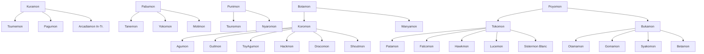

# MarkdownDocuments

```mermaid
flowchart TD
    KRM[Kuramon]-->TSM[Tsumemon]
    KRM-->PGM[Pagumon]
    KRM-->ARC[Arcadiamon In-Tr.]

    PBM[Pabumon]-->TNM[Tanemon]
    PBM-->YKM[Yokomon]
    PBM-->MTM[Motimon]

    PNM[Punimon]-->TSN[Tsunomon]
    PNM[Punimon]-->NYA[Nyaromon]

    BTM[Botamon]-->KOR[Koromon]
    BTM-->WNY[Wanyamon]

    KOR-->AGU[Agumon]
    KOR-->GUI[Guilmon]
    KOR-->TOA[ToyAgumon]
    KOR-->HCK[Hackmon]
    KOR-->DRC[Dracomon]
    KOR-->SHT[Shoutmon]

    PYM[Poyomon]-->TOK[Tokomon]
    PYM-->BUK[Bukamon]

    TOK-->PAT[Patamon]
    TOK-->FAL[Falcomon]
    TOK-->HAW[Hawkmon]
    TOK-->LUC[Lucemon]
    TOK-->SIS[Sistermon Blanc]

    BUK-->OTA[Otamamon]
    BUK-->GOM[Gomamon]
    BUK-->SYA[Syakomon]
    BUK-->BET[Betamon]
```
