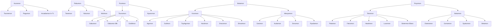

# MarkdownDocuments

```mermaid
flowchart TD
    KRM[Kuramon]
    TSM[Tsumemon]
    PGM[Pagumon]
    ARC[Arcadiamon In-Tr.]
    PBM[Pabumon]
    TNM[Tanemon]
    YKM[Yokomon]
    MTM[Motimon]
    PNM[Punimon]
    TSN[Tsunomon]
    PNM[Punimon]
    NYA[Nyaromon]
    GBM[Gabumon]
    GBL[Gabumon Blk]
    GBN[Goblimon]
    GBM[Gabumon]
    GBL[Gabumon Blk]
    GBN[Goblimon]
    BTM[Botamon]
    KOR[Koromon]
    WNY[Wanyamon]
    AGU[Agumon]
    GUI[Guilmon]
    TOA[ToyAgumon]
    HCK[Hackmon]
    DRC[Dracomon]
    SHT[Shoutmon]
    GAO[Gaomon]
    KUD[Kudamon]
    DOR[Dorumon]
    RYD[Ryudamon]
    PYM[Poyomon]
    TOK[Tokomon]
    BUK[Bukamon]
    PAT[Patamon]
    FAL[Falcomon]
    HAW[Hawkmon]
    LUC[Lucemon]
    SIS[Sistermon Blanc]
    OTA[Otamamon]
    GOM[Gomamon]
    SYA[Syakomon]
    BET[Betamon]
    
    KRM-->TSM
    KRM-->PGM
    KRM-->ARC

    PBM-->TNM
    PBM-->YKM
    PBM-->MTM

    PNM-->TSN
    PNM-->NYA

    TSN-->GBM
    TSN-->GBL
    TSN-->GBN
    TSN-->GBM
    TSN-->GBL
    TSN-->GBN

    BTM-->KOR
    BTM-->WNY

    KOR-->AGU
    KOR-->GUI
    KOR-->TOA
    KOR-->HCK
    KOR-->DRC
    KOR-->SHT

    WNY-->GAO
    WNY-->KUD
    WNY-->DOR
    WNY-->RYD

    PYM-->TOK
    PYM-->BUK

    TOK-->PAT
    TOK-->FAL
    TOK-->HAW
    TOK-->LUC
    TOK-->SIS

    BUK-->OTA
    BUK-->GOM
    BUK-->SYA
    BUK-->BET
```
